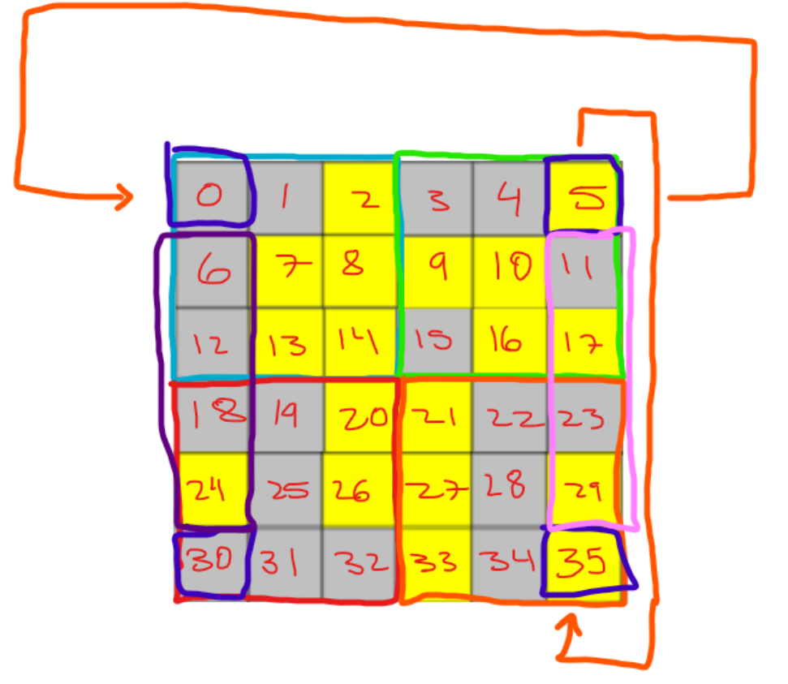

# The LightsOut Puzzle - Displayed on a monitor screen
* A lab that displays the LightsOut Puzzel to a monitor screen via the FPGA's VGA adapter cable.
* NOTE: Project utilizes Microblaze IP.

## Provided files by instructor(s) that may have been modified to achieve project objectives:
* Source code for these provided files can be found [here](https://academic.csuohio.edu/chu-pong/fpga-vhdl-soc-book/)

## Introduction:
* The LightsOut game is a grid of squares which are either on or off, and the goal is to utilize directional-buttons to position the cursor to effect different areas of squares in order to toggle all of them off.

## Approach used: 
Mostly software with one hardware sprite core that was repurposed code from the existing mouse pointer core.
The following tasks were fully completed:
1.	Red square sprite highlighter
2.	Movement across the entire 6x6 matrix
3.	Wrapping for horizontal and vertical movement
4.	Winning and losing patterns visible (Delays (such as sleep delays) crash the program so were avoided)
5.	Forced Win and Lose switch activations from SW0 and SW1
6.	Incorporated LFSR and random puzzle generation.
7.	Level increments up by 1 whenever the game is won.

Implementation deviations introduced to complete tasks:
1. Utilized the frame core driver to make the black and white tiles in the 6x6 table instead of a hardware implementation with RGB.
2. No memory or registor IO map is included since the provided mouse sprite core was copy and pasted into a separate file with just modified ROM values to draw out a red square sprite, and hooked into the user5 core-slice slot for use in software.

List of attempted but not completed tasks:
1. Time for a level not implemented fully, method structure exists but not implemented due to time constraints.

My approach was to take an object oriented programming one, where each tile in the 6x6 table is a "smart-tile" - it’ll track its own position of coordinates, its center coordinates for the highlighter sprite to snap to, and then references to other tiles that it would influence if it were to be selected to invert. Unfortunately, the code for that produced completely game-breaking results, where the 6x6 indexed entries of tiles got corrupted and everything on the screen submerged into chaos (ie white tiles everywhere, screen rendering black, things slowly getting un-rendered, and etc…). This could've been caused by Vitis or an unknown issue with the FPGA that I have no control over.

A 9-bit Linear Feedback Shift Register (LFSR) Entity was used to generate random patterns for the game puzzle, implemented in hardware (VHDL).

## Visual diagrams/schematics and pictures:
- LFSR Entity Schematic (Derived from Lab manual provided by lab/course instructor(s)):

- LFSR Wrapper schematic (used for testing LFSR)

- LFSR Entity Memory Map:

- LFSR Testbench Waveforms (LFSR Entity testbench code can be found in "LFSR Entity Only..." directory):

- Defining cursor values in the ROM:

- Layout out the pixel-grid with respect to the target resolution:

- Marking grid-wrapping and hotzones on the grid where area-of-effect of the cursor will change depending on the cursor's grid-index:

- Final Monitor display of the game:

- Resource Utilization:

## Concluding remarks:
This was a facinating lab and it showed me ways to deviate from the initial implementation details to implement parts in software (C++) instead of the hardware (VHDL) depending upon the situation - for example, RGB isn't needed for the tiles to have a functional game, therefore choosing to implement features in software where possible dramatically reduced complexity that would've resulted from hardware-only implementations.
